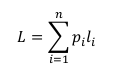

# Information und Codierung

+ Codierung 

    Darstellung einer Nachricht für dessen Speicherung und Übertragung.

    Ist nicht gleich Verschlüsselung, da es nicht unmöglich sein soll die Nachricht zu verstehen. Sie soll nur einfacher zu speichern oder schneller übertragbar sein.

    + soll Daten mit möglichst wenig Zeichen darstellen(Quellencodierung, Verkleinern der Redundanz)
    + möglichst unempfindlich gegen Störung sein
    + leicht zu verarbeiten

    1. Quellencodierung, Redundanz verkleinern
    2. Kanalcodierung, gezielte Erhöhung der Redundanz um gegen Störungen zu sichern. Das erleichertert sogar die Fehlererkennung bei Störungen.

## Quellencodierung    

+ mittlere Wortlänge L

    

    Wortlänge li des i-ten Zeichens

    Auftrittswahrscheinlickeit pi

+ Entropie H

    Entropie <= mittlere Wortlänge

    Entropie ist die Häufigkeitsverteilung

+ Redundanz R

    Redundanz = mittlere Wortlänge - Entropie

    ... gibt an wie groß der statistisch redundante Anteil der Nachricht ist

    + Quellenredundanz

        alleinig abhängig von der Anzahl der Zeichen des Alphabets

+ BCD Codierung

    Für Codierung von Zahlen

    jede Ziffer wird einzeln betrachtet und codiert, bzw. decodiert

+ ASCII

    häufige Verwendung für Codierung von Buchstaben, Ziffern und Sonderzeichen

    7-Bit -> Zeichenvorrat 128

+ Unicode // UTF

    Erweiterung von ASCII auf 16 bzw 32 bit

+ Huffman Codierung

    Für Code mit variabler Wortlänge

    wichtig ist die Ordnung der Zeichen nach der Auftrittswahrscheinlichkeit

    die Zeichen mit der geringsten Auftrittswahrscheinlichkeit werden zu erst über einen Knoten verbunden, die sein auch am weitesten vom Ursprung weg

+ Fano Bedingung

    Ein Codewort muss immer einen eindeutigen Anfang/Präficx haben
    --> in dem Code-Baum dürfen sie nur die Endknoten besetzen

## Kanalcodierung

+ Hammingdistanz

    Maß für Störsicherheit

    Anzahl der Stellen in der sich 2 gleich lange Binärwörter unterscheiden --> xXORy (dann einsen zählen)

+ Stellendistanz

    Maß für Fehler bei Übertragung

    gibt die Anzahl der Fehlerhaften Stellen an

    