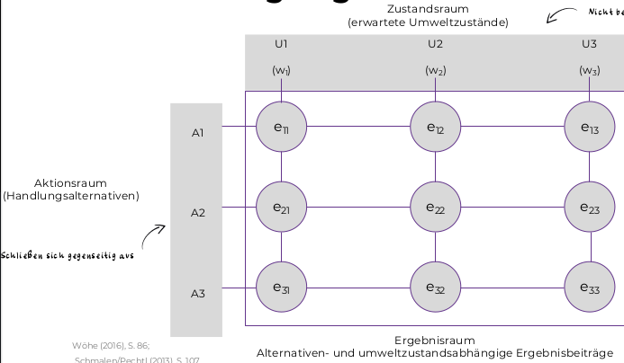
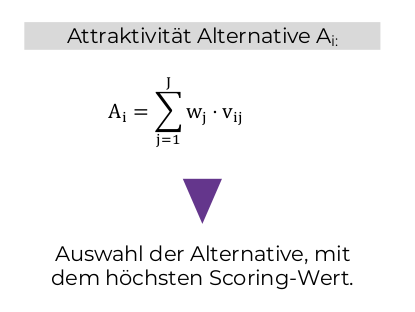

# Planen, Entscheiden, Kontrollieren

## 2.3 Entscheidungstheorie-Grundlagen

### Zentrale Fragestellung

Wie ist in einer Situation umzugehen, damit ein größmöglicher Zielerfüllungsgrad verwirklicht wird?

Bestmögliche Handlungsmöglichkeit wählen.

### Präskriptive Entscheidungstheorie(Entscheidungsregeln)

+ Vorgabe von Regeln die Entscheidungssituationen abschaffen
+ Ausgang von rational handelndem Akteur
+ nicht Realitätsnah
    
### Deskriptive Entscheidungstheorie(Empirische Untersuchungen)

+ bebschreibung und Erklärung von realem Entscheidungsverhalten
+ Annahme von eingschränkter Rationalität, also kann auch emotional handeln

Unter den beiden Entscheidungstheorien gibt es weitere Schwerpunkte

+ Individuum // Gruppe

    + Ein Ziel // mehrere Ziele

        + Unterscheidung zwischen vollkommenen Informationen und unvollkommenen Informationen

            Wenn man dort unvollkommene Informationen hat muss man auch das Risiko, bzw. die Unsicherheit betrachten.
            
            Risiko: Konsequenzen sind unbekannt, aber Eintrittswahrscheinlichkeiten

            Unsicherheit: Konsequenzen und Eintrittswahrscheinlichkeiten sind unbekannt

## 2.4 Entscheidungsregeln-Individuum-ein Ziel

+ Risikoneigung

    Bereitschaft vom Individuum unsichere Ergebnisse in Kraft zu nehmen

+ Grenznutzen

    Nutzensteigung(als Funktion) bei zusätzlichen oder weniger Konsum des Gutes

    + Risikofreudig

        Grenznutzenfunktion steigt stark an

    + Risikoavers

        Grenznutzenfunktion nimmt stark ab
        
    + Risikoneutral

        Grenznutzen ist konstant

    ### Entscheidungsregeln bei Unsicherheit

    umweltabhängige Einzelergebnisse sind bekannt, aber die Eintrittswahrscheinlichkeiten sind unbekannt

    + Maximax-Regel

        Die unsichere Alternative wird bevorzugt

    + Minimax-Regel

        Die sichere Alternative wird bevorzugt

    + Laplace-Regel

        Beide Alternativen werden gleichwertig in Betracht gezogen

    

    ### Entscheidungsregel unter Risiko

    umweltabhängige Einzelergebnisse sind bekannt und die Eintrittswahrscheinlichkeiten sind bekannt

    + Bayes-Prinzip

        Risikoneutraler Entscheider wählt den höchsten Erwartungswert.

    Die Standadabweichung kann hier bei mehreren gleichen Erwartungswerten eingesetzt werden um eine Entscheidung 
    zu fällen.

    ## 2.5 Nutzwertanalyse-Individuum-mehrere Ziele

    

    w ist die Zielgewichtung, v ist der Nutzwert